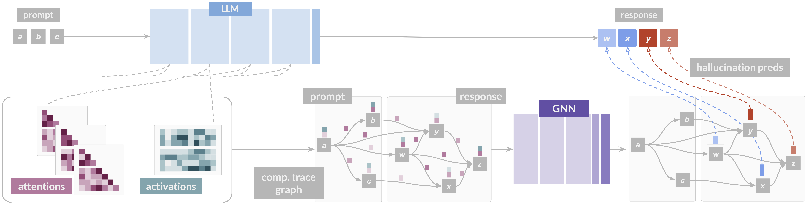

# CHARM



This is the code repository for paper [Neural Message-Passing on Attention Graphs for Hallucination Detection](https://openreview.net/forum?id=4twbqwV4br) (published in the proceedings of ICLR 2026).

**Abstract**
> Large Language Models (LLMs) often generate incorrect or unsupported content, known as hallucinations. Existing detection methods rely on heuristics or simple models over isolated computational traces such as activations, or attention maps. We unify these signals by representing them as attributed graphs, where tokens are nodes, edges follow attentional flows, and both carry features from attention scores and activations. Our approach, CHARM, casts hallucination detection as a graph learning task and tackles it by applying GNNs over the above attributed graphs. We show that CHARM provably subsumes prior attention-based heuristics and, experimentally, it consistently outperforms other leading approaches across diverse benchmarks. Our results shed light on the relevant role played by the graph structure and on the benefits of combining computational traces, whilst showing CHARM exhibits promising zero-shot performance on cross-dataset transfer.

If you find this useful for your research, please cite us as:
```
@inproceedings{
frasca2026neural,
title={Neural Message-Passing on Attention Graphs for Hallucination Detection},
author={Fabrizio Frasca and Guy Bar-Shalom and Yftah Ziser and Haggai Maron},
booktitle={The Fourteenth International Conference on Learning Representations},
year={2026},
url={https://openreview.net/forum?id=4twbqwV4br}
}

```

... and if you want to know more about this line of research more in general, take a look at our Substack blogpost:
> [Detecting LLM Misbehaviors from the Inside Out with Deep Learning on Structured Data](https://ffabffrasca.substack.com/p/detecting-llm-misbehaviors-from-the)

## Environments

First off, conda virtual environments. Run the commands below to install them. You will find specified the package versions used by ourselves during the development of the work.

### Environment 1 (data prep 1)

This is used to prepared datasets `NQ` and `CNN`.

```
conda create -n charm_data_1 python=3.9.21 
conda activate charm_data_1 
export TORCH=2.0.0
export CUDA=cu117
pip install torch==2.0.0+cu117 torchvision==0.15.0+cu117 torchaudio==2.0.0 --index-url https://download.pytorch.org/whl/${CUDA}
pip install pyg_lib torch_scatter torch_sparse torch_cluster torch_spline_conv -f https://data.pyg.org/whl/torch-${TORCH}+${CUDA}.html
pip install torch_geometric
pip install -r reqs/reqs_1.txt
pip install -e ./transformers-4.32.0
```

### Environment 2 (data prep 2)

This is used to prepared datasets `Movies` and `Winobias`, `Math`.

```
conda create -n charm_data_2 python=3.9.21 
conda activate charm_data_2 
export TORCH=2.2.0
export CUDA=cu121
pip install torch==2.2.0 torchvision==0.17.0 torchaudio==2.2.0 --index-url https://download.pytorch.org/whl/${CUDA}
pip install pyg_lib torch_scatter torch_sparse torch_cluster torch_spline_conv -f https://data.pyg.org/whl/torch-${TORCH}+${CUDA}.html
pip install torch_geometric
pip install -r reqs/reqs_2.txt
```

### Experiments

This is the main environment used to run experiments, like training a new CHARM, evaluating a CHARM checkpoint, or running baselines.

```
conda create -n charm_exp python=3.10
conda activate charm_exp
export CUDA=cu126
pip install torch==2.7.0 torchvision torchaudio
export TORCH=2.7.0
pip install pyg_lib torch_scatter torch_sparse torch_cluster torch_spline_conv -f https://data.pyg.org/whl/torch-${TORCH}+${CUDA}.html
pip install torch_geometric
pip install scikit-learn==1.6.1
pip install transformers==4.52.4
pip install wandb==0.20.1
pip install matplotlib==3.10.5
```

## Preliminaries
[WIP]

## Data preparation

### Data preparation 1

Follow these steps to create the `NQ` and `CNN` datasets by yourself.

N.B.: Use environment `charm_data_1`.

#### Extract neural artefacts (and extract graphs)

The following python command extracts raw neural artefacts from the LLM generation, inclusive of attention graphs, activations for specified layers, output scores (token probabilities) and lookback lens features.

Both this python module and the one for annotations (see next section) are adapted from the original code by the [Lookback Lens](https://github.com/voidism/Lookback-Lens) repo.

**nq**

```
python -m data_prep_1.data_collection \
    --model-name meta-llama/Llama-2-7b-chat-hf \
    --data-path raw_data/nq-open-10_total_documents_gold_at_4.jsonl \
    --output-suffix nq-llama-2-7b-chat-05__24_28_32 \
    --teacher-forcing-jsonl raw_data/tf-nq-7b.jsonl \
    --att_graph \
    --att_threshold 0.05 \
    --act \
    --act_layers 24,28,32 \
    --scores \
    --lookback \
    --num-gpus 4
```

On the specified arguments:
- `model-name`: the name of the LLM, we only experiment with `meta-llama/Llama-2-7b-chat-hf` here;
- `data-path`: the original raw data for nq, in this case;
- `output-suffix`: the name of the output data folder as produced by the script;
- `teacher-forcing-jsonl`: the precalculated output response we use as teacher forcing data (see paper);
- `att-graph`: passed as a flag to collect attention graphs;
- `att_threshold`: the theshold considered to sparsify the attention graphs as specified in the paper';
- `act`: passed as a flag to collect activations;
- `act_layers`: the layers from which to collect activations;
- `scores`: passed as flag to collect output scores (token probas);
- `lookback`: passed as flag to collect lookback lens scores;
- `num-gpus`: the number of gpus to use to parallelise LLM inference (specify as needed).

A note on the naming of the output format (`output-suffix`). The structure follows this convention:
```
<dataset name>-<llm>-<decimal digits in attention tresholding>__<activation layers>
```
Within this folder placed inside `raw_data`, the script will store lists of dictionaries with the collected raw artefacts, one per artefact class.

**cnn**

```
python -m data_prep_1.data_collection \
    --model-name meta-llama/Llama-2-7b-chat-hf \
    --data-path raw_data/cnndm-1000.jsonl \
    --output-suffix cnn-llama-2-7b-chat-05__24_28_32 \
    --teacher-forcing-jsonl raw_data/tf-cnn-7b.jsonl \
    --att_graph \
    --att_threshold 0.05 \
    --act \
    --act_layers 24,28,32 \
    --scores \
    --lookback \
    --num-gpus 4
```

#### Pair up with (precomputed) annotations

The following calculates annotations for the (teacher-forced) responses, as per the original procedure in Lookback Lens. These token-wise annotations are paired up with graphs, packed into a data list that will be used later on to generate Pytorch Geometric graph datasets. Annotations are stored separately as well, e.g., to be paired up with other artefacts when running baselines.

**nq**

```
python -m data_prep_1.data_annotation \
    --data_path raw_data/nq-llama-2-7b-chat-05__24_28_32/att_nq-llama-2-7b-chat-05__24_28_32_42.pt \
    --anno_path raw_data/anno-nq-7b.jsonl \
    --dataset_root data/nq-llama-2-7b-chat-05__24_28_32_42
```

On the specified arguments:
- `data-path`: where the collected attention graphs are stored (see previous collection step);
- `anno_path`: the path of the annotations as provided by the Lookback Lens authors;
- `dataset_root`: the root folder of the Pytorch Geometric dataset; the script will write the graph data list and the annotations here (under a `raw` subfolder). Note, here we are explicitly using the suffix `_42` consistently with the seed used in the previous step (`42` is the default one).

**cnn**

```
python -m data_prep_1.data_annotation \
    --data_path raw_data/cnn-llama-2-7b-chat-05__24_28_32/att_cnn-llama-2-7b-chat-05__24_28_32_42.pt \
    --anno_path raw_data/anno-cnndm-7b.jsonl \
    --dataset_root data/cnn-llama-2-7b-chat-05__24_28_32_42
```

#### Generate splits

This generates training, validation and test splits, with prompt-response pairs chosen at random with default ratios, respectively, 60%, 20%, 20%, and the usual default seed `42`.

**nq**

```
python -m data_prep_1.data_split \
    --data_root data/nq-llama-2-7b-chat-05__24_28_32_42
```

**cnn**

```
python -m data_prep_1.data_split \
    --data_root data/cnn-llama-2-7b-chat-05__24_28_32_42
```

At this point we are ready to run the training process (or the evaluation of a checkpoint). Further data preprocessing will be run by the training / evaluation scripts.

### Data preparation 2

Follow these steps to create the `Movies`, `Winobias` and `Math`, datasets by yourself.

N.B.: Use environment `charm_data_2`.

#### Extract neural artefacts (and extract graphs)

The following is to generated responses, extract all artefacts together and calculate annotations. Differently from above, the test split is already provided, and the data collection is performed separately for training and test (before I forget: yes, the validation split we will carve out from the provided training set). Both the response generation and annotation are done consistently with [`LLMs know what they know`](https://github.com/technion-cs-nlp/LLMsKnow).

A few notes:
- In the following commands we ask for 10,000 samples; effectively, this will take the whole datasets as there are none containing more than this amount of data.
- Differently than the code for the other datasets above, here we will store artefacts sample by sample separately. This is especially convenient for these larger datasets: in case the process is interrupted we can then resume the process simply where we left off.

**movies**

```
python -m data_prep_2.data_collection \
    --dataset movies \
    --model-name mistralai/Mistral-7B-Instruct-v0.2 \
    --output_suffix movies-mistral-7b-i-05__24_28_32 \
    --num_samples 10000 \
    --att_graph \
    --att_threshold 0.05 \
    --act \
    --act_layers 24,28,32 \
    --scores
```

```
python -m data_prep_2.data_collection \
    --dataset movies_test \
    --model-name mistralai/Mistral-7B-Instruct-v0.2 \
    --output_suffix movies-mistral-7b-i-05__24_28_32_test \
    --num_samples 10000 \
    --att_graph \
    --att_threshold 0.05 \
    --act \
    --act_layers 24,28,32 \
    --scores
```

**math**

```
python -m data_prep_2.data_collection \
    --dataset math \
    --model-name mistralai/Mistral-7B-Instruct-v0.2 \
    --output_suffix math-mistral-7b-i-05__24_28_32 \
    --num_samples 10000 \
    --att_graph \
    --att_threshold 0.05 \
    --act \
    --act_layers 24,28,32 \
    --scores
```

```
python -m data_prep_2.data_collection \
    --dataset math_test \
    --model-name mistralai/Mistral-7B-Instruct-v0.2 \
    --output_suffix math-mistral-7b-i-05__24_28_32_test \
    --num_samples 10000 \
    --att_graph \
    --att_threshold 0.05 \
    --act \
    --act_layers 24,28,32 \
    --scores
```

**winobias**

```
python -m data_prep_2.data_collection \
    --dataset winobias \
    --model-name mistralai/Mistral-7B-Instruct-v0.2 \
    --output_suffix winobias-mistral-7b-i-05__24_28_32 \
    --num_samples 10000 \
    --att_graph \
    --att_threshold 0.05 \
    --act \
    --act_layers 24,28,32 \
    --scores
```

```
python -m data_prep_2.data_collection \
    --dataset winobias_test \
    --model-name mistralai/Mistral-7B-Instruct-v0.2 \
    --output_suffix winobias-mistral-7b-i-05__24_28_32_test \
    --num_samples 10000 \
    --att_graph \
    --att_threshold 0.05 \
    --act \
    --act_layers 24,28,32 \
    --scores
```

#### Pair up with annotations

Similarly as done above for the other datasets: the script will store a data list and list of labels inside the `raw` subfolder of the dataset root folder, ready for training and its preprocessing. Differently than before, but consistently with the functionality of the above scripts for the first category of datasets this will also "consolidate" other artefacts other than attention graphs in a single list also stored in the `raw` subfolder.

N.B. We pass here the expected number of train and test samples, which will be tested against.

**movies**

```
python -m data_prep_2.data_annotation \
    --data_path ./raw_data/movies-mistral-7b-i-05__24_28_32_42 \
    --anno_path ./raw_data/movies-mistral-7b-i-05__24_28_32_42 \
    --dataset_root ./data/movies-mistral-7b-i-05__24_28_32_42 \
    --expected_train 10000 \
    --expected_test 7856
```

**math**

```
python -m data_prep_2.data_annotation \
    --data_path ./raw_data/math-mistral-7b-i-05__24_28_32_42 \
    --anno_path ./raw_data/math-mistral-7b-i-05__24_28_32_42 \
    --dataset_root ./data/math-mistral-7b-i-05__24_28_32_42 \
    --expected_train 1950 \
    --expected_test 650
```

**winobias**

```
python -m data_prep_2.data_annotation \
    --data_path ./raw_data/winobias-mistral-7b-i-05__24_28_32_42 \
    --anno_path ./raw_data/winobias-mistral-7b-i-05__24_28_32_42 \
    --dataset_root ./data/winobias-mistral-7b-i-05__24_28_32_42 \
    --expected_train 1584 \
    --expected_test 1584
```

#### Generate splits

This simply carves out the validation split and writes the split data in the dataset root.

**movies**

```
python -m data_prep_2.data_split \
    --data_root ./data/movies-mistral-7b-i-05__24_28_32_42 \
    --test_offset 10000
```

**math**

```
python -m data_prep_2.data_split \
    --data_root ./data/math-mistral-7b-i-05__24_28_32_42 \
    --test_offset 1950
```

**winobias**

```
python -m data_prep_2.data_split \
    --data_root ./data/winobias-mistral-7b-i-05__24_28_32_42 \
    --test_offset 1584
```

## Train CHARM

The python module `run_exp.py` wraps up all the logic to run experiments for a certain number of seeds and calculate mean performance, along with standard deviation. It reads an experiment configuration, where all necessary args are prespecified.

In folder `configs/charm` we provide all the configurations with the selected hyperparameters to reproduce the CHARM results reported in the paper.

Simply run:
```
python run_exp.py --config configs/charm/<dataset_name>_att.yaml
```

or, for the CHARM version that also processes activations:

```
python run_exp.py --config configs/charm/<dataset_name>_att_act.yaml
```

This gives us the following list of commands you can use for `NQ` and `CNN`:

```
python run_exp.py --config configs/charm/nq_att.yaml
python run_exp.py --config configs/charm/nq_att_act.yaml
```

```
python run_exp.py --config configs/charm/cnn_att.yaml
python run_exp.py --config configs/charm/cnn_att_act.yaml
```

... and this is the list for `Movies`, `Winobias`, `Math`. *Importantly*, the require an additional data dumping step to be run with the provided configurations, see below.

```
python run_exp.py --config configs/charm/movies_att.yaml
python run_exp.py --config configs/charm/movies_att_act.yaml
```

```
python run_exp.py --config configs/charm/winobias_att.yaml
python run_exp.py --config configs/charm/winobias_att_act.yaml
```

```
python run_exp.py --config configs/charm/math_att.yaml
python run_exp.py --config configs/charm/math_att_act.yaml
```

Note that this will run for a number of three different seeds in total (default).


Otherwise, one can run a single training experiment by running the `training.py` python module directly, like this (just an example):

```
python training.py \
    --data ./data/nq-llama-2-7b-chat-05__24_28_32_42 \
    --tokenwise \
    --disable_marks \
    --mark_prompt_edges \
    --attention_threshold 0.05 \
    --llm_layers all \
    --num_epochs 75 \
    --learning_rate 0.001 \
    --scheduler cosine_warm \
    --batch_size 32 \
    --eval_prebatch \
    --dropout_rate 0.25 \
    --weight_decay 0.0 \
    --hidden_dim 64 \
    --num_layers 2 \
    --flow source_to_target \
    --readout mean \
    --aggr mean \
    --activation none \
    --layer custom \
    --encoder linear \
    --on_x \
    --acts '' \
    --checkpoint_best
```

#### In memory datasets vs. from disk data loading

*Important*: the training can be run fully in memory or by loading single samples from disk. The former has a larger initial loading time, but can be faster overall. The latter starts the training immediately and is much more lenient in terms of memory utilisation, but can be a bit slower. Training from disk also requires an additional dumping step (see below).

In our experiments, accoring to the configuraions provided in `./configs/charm/`:
- In memory training is the default for `NQ`, `CNN`;
- Training with data on disk is the default for `Movies`, `Winobias`, `Math`.

In order to train from disk, run this preliminary step to prepare data:

```
python run_exp.py --config configs/charm/<dataset_name>_att.yaml --dump
```

or, if using activations:

```
python run_exp.py --config configs/charm/<dataset_name>_att_act.yaml --dump
```

After this is completed, simply run without the `--dump` flag, and make sure your cofiguration has flag `on_disk` set to `true`, and flag `dump_data_only` set to `false`.

### Getting (more) familiar with configurations and arguments within

Let us take a look at the configuration arguments. This could instructive to you, especially if you are willing to build on top of this codebase, or if you are simply curious. We take the `nq_att.yaml` config as an example.

#### Data and task configuration

```
data: "./data/nq-llama-2-7b-chat-05__24_28_32_42"
tokenwise: true
disable_marks: true
mark_prompt_nodes: false
mark_start_prompt: false
mark_prompt_edges: true
attention_threshold: 0.05
llm_layers: "all" 
```

This specifies:
- the data root path
- that the task is tokenwise as opposed e.g., to `Movies` and friends
- that we would like to (only) mark prompt edges out of all edges, i.e., those involving prompt tokens
    - N.B.: it could be counterintuituive, but we set `disable_marks` to `true` simply because we would like to specify manually what to mark (the prompt edges only); the default behaviour we are disabling is to apply a bunch of marks.
- that the attention threshold for graph sparsification is 0.05 (this is already what imposed at data collection, so no additional work is required)
- that we would like to use attention scores from all LLM layers (yes you can play with this as well)

#### Training configuration

```
num_epochs: 75
patience: 20
learning_rate: 0.0005
scheduler: "cosine_warm"
balance: false
batch_size: 32
eval_prebatch: true
train_prebatch: false
train_prebatch_interval: 10  # NOTE: Irrelevant given line above
```

Let us only comment on the most interesting args here.
- `patience` is used to kill the experiment before the specified number of epochs if performance is simply degrading badly
- `balance` is to balance classes in the loss; we experimented with this but it did not help; we are setting it to false
- `eval_prebatch` prebatches evaluation samples (i.e., those in test and validation splits) to save time when calculating performance metrics
- `train_prebatch` does the same on the training samples, but, differently than above, this is not seamless as the optimisation process may be influenced by a lack of stochasticity (!); this is why we have `train_prebatch_interval`, which specifies the frequency by which train batches are re-assembled to mitigate optimisation bias.
    - we do not use training prebatching in our experiments, but we are leaving this here for you to play with, should you want to

#### Regularisation hypers

```
dropout_rate: 0.25
weight_decay: 0.0
weight_decay_target: "attr_encoders.act"
weight_decay_for_target: 0.001  # NOTE: This has no effect if we do not use activations
```

Standard stuff. The only notable arg is `weight_decay_for_target` which allows to specifiy a particular decay strength for `weight_decay_target` parameters.

#### Architectural hypers

```
hidden_dim: 128
num_layers: 2
flow: "source_to_target"
readout: "mean"  # NOTE: This has no effect if the task is tokenwise
aggr: "mean"
activation: "none"
layer: "custom"
encoder: "linear"
batch_norm: "no"
residual: "no"
attr_encoder_location: "beginning"  # NOTE: This has no effect if we do not use activations
cat_attr: "no"
```

Usual things, let us just mention:
- `flow`: is used to specify the direction by which messages flow in our GNN
- `aggr` is the aggregation function for messages in our GNN
- `activation` is used to specify non-linearities in between GNN layers; we do not specify anything (our `custom` layers are already intrinsically non-linear)
- `encoder` specifies how initial features are encoded before message passing
- `attr_encoder_location` is used to specify where additional artefacts like activations are introduced; in our experiments this is always at the beginning
- `cat_attr` whether to concatenate them rather than summing to other features

#### Additional artefacts

```
on_x: true
acts: ""
act_llm_layers: "24"
```

Here:
- `on_x` says additional artefacts like activations (if any) are included as standard node-features instead of being considered as separate objects in the graph object requiring special treatment
- `acts` specifies the path where to read the activations from (here we are leaving it empty: attention only)
- `act_llm_layers`: which layer(s) to read activations from; no effect if we are not using activations

#### Logging

```
log: true
verbose: false
```

- `log` writes data on wandb (make sure to set it up if you want to use it)
- `verbose` additionally prints timing information while training

#### Checkpointing

```
checkpoint_folder: './checkpoints'
checkpoint_best: true
```

In case you want to save the best model.

#### Training with data on disk

```
dump_data_only: false
on_disk: false
```

See section above on training from disk.

## Baselines

Similarly to CHARM, we provide a python module that abstracts out running and evaluating baselines with the best hyperparameters consistently with our paper. Again, this will read them from configurations under `./configs/baselines/`. It suffices to run the following command:

```
python run_baseline.py --config configs/baselines/<dataset_name>.yaml --base <baseline_name>
```

The tag `<baseline_name>` is chosen as follows in `NQ` and `CNN`:
- `atp`: Output Probabilities;
- `act`: Activations (it runs on layers 24, 28, 32);
- `lb`: Lookback Lens;
- `lb++`: Lookback Lens with tuned logistic regression regularisation parameter (see paper, marked with dagger);
- `node_avg`: Neigh-Avg(N) (see paper);
- `edge_avg`: Neigh-Avg(E) (see paper).

For `Movies`, `Winobias`, `Math` you can choose it as:
- `atp`;
- `act`;
- `lc`: LLM-Check;
- `lc++`: LLM-Check++ in our paper: we attach a logistic regression module to the LLM-Check features;
- `lapeig`: the LapEig baseline;
- `node_avg`;
- `edge_avg`.

## Transfer

Run the dataset transfer experiment with the `evaluation.py` module, supplying the configuration in `./configs/transfer/nq_cnn.yaml`:

```
python evaluation.py --config configs/transfer/nq_cnn.yaml
```

Internally, the config specifies model checkpoints to load. We are already providing them in `./checkpoints`, unless you want to use yours.

## 🙏

Thanks so much for making it to the end of this README! Apologies if you have found this longer than needed.


